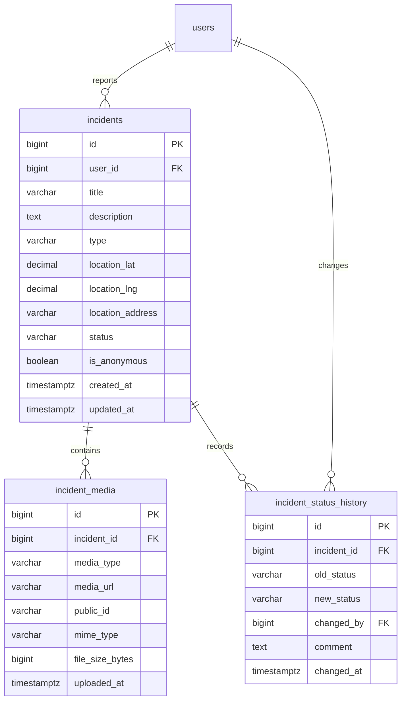

# Ajali Incident Management Schema

This schema is owned by Team Member 2. It supports incident reporting, media
attachments, and an immutable status-change history. PostgreSQL is assumed.

## Entity Relationship



## PostgreSQL DDL

The `users` table is owned by Team Member 1 and is referenced here only by its
`id` column.

```sql
CREATE TYPE incident_status AS ENUM (
    'reported',
    'under_review',
    'in_progress',
    'resolved',
    'rejected'
);

CREATE TYPE incident_media_type AS ENUM ('image', 'video');

CREATE TABLE incidents (
    id BIGSERIAL PRIMARY KEY,
    user_id BIGINT NOT NULL REFERENCES users(id) ON DELETE RESTRICT,
    title VARCHAR(120) NOT NULL,
    description TEXT NOT NULL,
    type VARCHAR(40) NOT NULL,
    location_lat NUMERIC(9, 6) NOT NULL CHECK (location_lat BETWEEN -90 AND 90),
    location_lng NUMERIC(9, 6) NOT NULL CHECK (location_lng BETWEEN -180 AND 180),
    location_address VARCHAR(255) NOT NULL,
    status incident_status NOT NULL DEFAULT 'reported',
    is_anonymous BOOLEAN NOT NULL DEFAULT FALSE,
    created_at TIMESTAMPTZ NOT NULL DEFAULT CURRENT_TIMESTAMP,
    updated_at TIMESTAMPTZ NOT NULL DEFAULT CURRENT_TIMESTAMP
);

CREATE TABLE incident_media (
    id BIGSERIAL PRIMARY KEY,
    incident_id BIGINT NOT NULL REFERENCES incidents(id) ON DELETE CASCADE,
    media_type incident_media_type NOT NULL,
    media_url TEXT NOT NULL,
    public_id VARCHAR(255),
    mime_type VARCHAR(100) NOT NULL,
    file_size_bytes BIGINT NOT NULL CHECK (file_size_bytes > 0),
    uploaded_at TIMESTAMPTZ NOT NULL DEFAULT CURRENT_TIMESTAMP
);

CREATE TABLE incident_status_history (
    id BIGSERIAL PRIMARY KEY,
    incident_id BIGINT NOT NULL REFERENCES incidents(id) ON DELETE CASCADE,
    old_status incident_status,
    new_status incident_status NOT NULL,
    changed_by BIGINT NOT NULL REFERENCES users(id) ON DELETE RESTRICT,
    comment TEXT,
    changed_at TIMESTAMPTZ NOT NULL DEFAULT CURRENT_TIMESTAMP,
    CHECK (old_status IS NULL OR old_status <> new_status)
);

CREATE INDEX incidents_user_created_idx
    ON incidents (user_id, created_at DESC);
CREATE INDEX incidents_status_created_idx
    ON incidents (status, created_at DESC);
CREATE INDEX incidents_type_idx ON incidents (type);
CREATE INDEX incidents_location_idx ON incidents (location_lat, location_lng);
CREATE INDEX incident_media_incident_idx ON incident_media (incident_id);
CREATE INDEX incident_history_incident_changed_idx
    ON incident_status_history (incident_id, changed_at DESC);
```

## Rules

- A newly created incident has status `reported`.
- Creating an incident also creates its first history row with `old_status = NULL`
  and `new_status = 'reported'`.
- Status history is append-only. Updates to an incident status must insert a
  history row in the same database transaction.
- Only the incident owner may update or delete their own incident. Admin
  authorization is handled by Team Member 3.
- Deleting an incident cascades to its media and status history. Cloudinary
  objects must be deleted by the service layer before or as part of that flow.
- `is_anonymous` hides reporter identity in public responses; it does not remove
  `user_id` from the database.
- Allowed upload MIME types should be validated in the service layer. Suggested
  limits are 10 MB per image and 50 MB per video.

## Create Request

```json
{
  "title": "Blocked drainage near market",
  "description": "Water is collecting across the pedestrian entrance.",
  "type": "flood",
  "location_lat": -1.286389,
  "location_lng": 36.817223,
  "location_address": "City Market, Nairobi",
  "is_anonymous": false
}
```

`user_id`, `status`, timestamps, and media records are server-managed. The API
should return the incident with nested media and the latest status history when
the detail endpoint is requested.

## Migration Order

1. Ensure Team Member 1's `users` table exists.
2. Create the incident enums.
3. Create `incidents`.
4. Create `incident_media` and `incident_status_history`.
5. Add the indexes.
